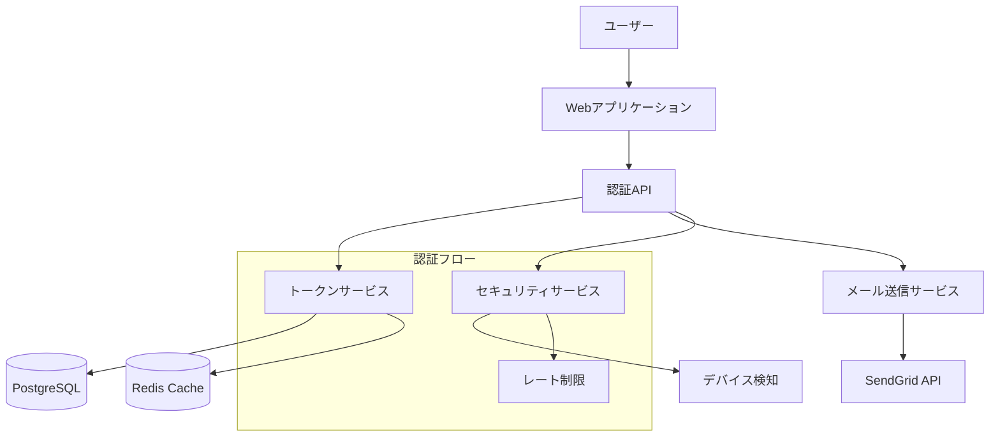
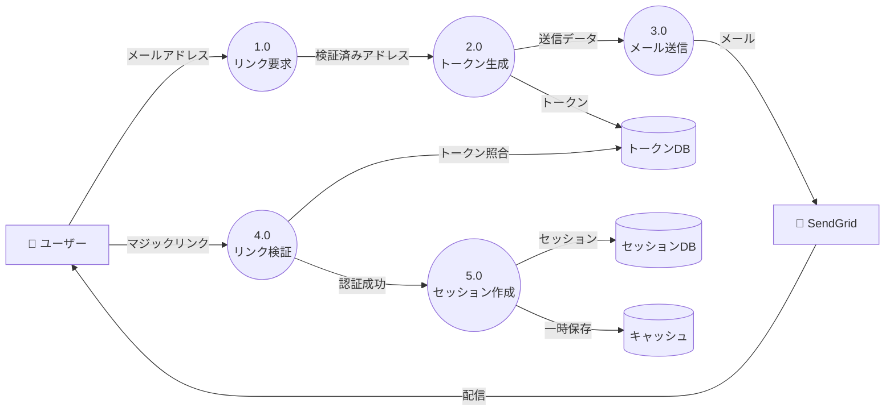
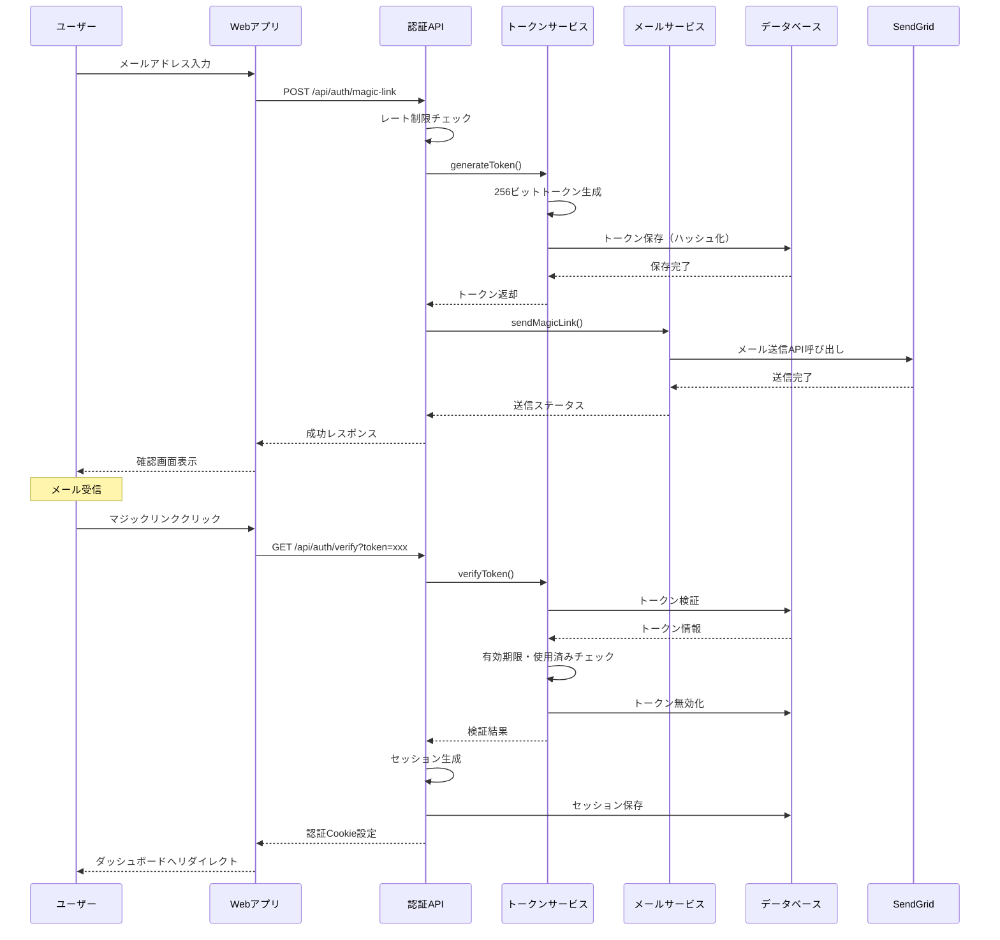
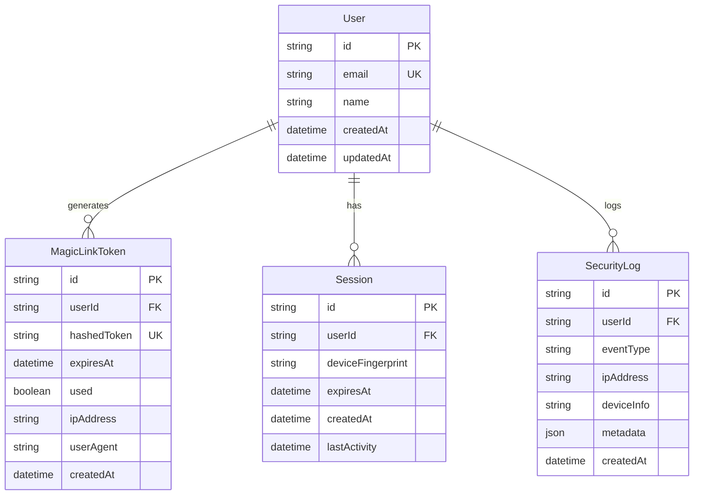

# マジックリンク認証機能 設計文書

## 概要

パスワードレス認証を実現するマジックリンク機能を実装し、ユーザーのログイン体験を向上させます。メールアドレスに送信される一時的なリンクをクリックすることで、パスワード入力なしに安全な認証を可能にします。本設計書では、要件定義書で定義された3つのユーザーストーリー（マジックリンクリクエスト、認証処理、セキュリティ通知）を実現するための技術的実装を詳細に定義します。

## アーキテクチャ

### システム構成図



### データフロー図（DFD）



### データフロー説明

1. **マジックリンクリクエストフロー**
   - ユーザーがメールアドレスを入力
   - メールアドレスの形式検証とレート制限チェック
   - 暗号学的に安全なトークンの生成（256ビット）
   - トークンのハッシュ化とデータベース保存
   - メール送信キューへの登録

2. **メール送信フロー**
   - SendGrid APIを使用したメール送信
   - HTMLとテキストのマルチパート形式
   - リンクの有効期限（15分）を明記
   - 配信ステータスの追跡

3. **認証処理フロー**
   - マジックリンクのトークン抽出
   - トークンの有効性検証（期限、使用済み、ハッシュ照合）
   - セッション生成と Cookie 設定
   - トークンの即座の無効化
   - ダッシュボードへのリダイレクト

## シーケンス図

### マジックリンク認証の全体フロー



## コンポーネントとインターフェース

### データベース設計

#### ERD



#### Prismaスキーマ

```prisma
model User {
  id              String            @id @default(cuid())
  email           String            @unique
  name            String?
  createdAt       DateTime          @default(now())
  updatedAt       DateTime          @updatedAt
  magicLinkTokens MagicLinkToken[]
  sessions        Session[]
  securityLogs    SecurityLog[]
  
  @@index([email])
  @@map("users")
}

model MagicLinkToken {
  id          String   @id @default(cuid())
  userId      String
  hashedToken String   @unique
  expiresAt   DateTime
  used        Boolean  @default(false)
  ipAddress   String?
  userAgent   String?
  createdAt   DateTime @default(now())
  user        User     @relation(fields: [userId], references: [id], onDelete: Cascade)
  
  // インデックス戦略
  @@index([hashedToken])           // トークン検証の高速化
  @@index([userId, createdAt])     // ユーザー別の履歴取得
  @@index([expiresAt])              // 期限切れトークンのクリーンアップ
  @@map("magic_link_tokens")
}

model Session {
  id               String   @id @default(cuid())
  userId           String
  deviceFingerprint String?
  expiresAt        DateTime
  createdAt        DateTime @default(now())
  lastActivity     DateTime @default(now())
  user             User     @relation(fields: [userId], references: [id], onDelete: Cascade)
  
  @@index([userId])
  @@index([expiresAt])              // セッション期限管理
  @@map("sessions")
}

model SecurityLog {
  id         String   @id @default(cuid())
  userId     String
  eventType  String   // LOGIN, LOGOUT, TOKEN_REQUEST, etc.
  ipAddress  String?
  deviceInfo String?
  metadata   Json?
  createdAt  DateTime @default(now())
  user       User     @relation(fields: [userId], references: [id], onDelete: Cascade)
  
  @@index([userId, eventType])      // イベントタイプ別の監査
  @@index([createdAt])               // 時系列での分析
  @@map("security_logs")
}
```

### API エンドポイント

| メソッド | エンドポイント | 説明 | リクエスト | レスポンス |
|---------|---------------|------|------------|------------|
| POST | `/api/auth/magic-link` | マジックリンク送信 | `{email: string}` | `{success: boolean, message: string}` |
| GET | `/api/auth/verify` | トークン検証 | `?token=xxx` | リダイレクト or エラー |
| POST | `/api/auth/logout` | ログアウト | - | `{success: boolean}` |
| GET | `/api/auth/session` | セッション確認 | - | `{user: User \| null}` |
| POST | `/api/auth/resend` | リンク再送信 | `{email: string}` | `{success: boolean, message: string}` |

### フロントエンドコンポーネント

```typescript
// ディレクトリ構造
/components/auth/
├── MagicLinkForm.tsx          // メールアドレス入力フォーム
├── VerificationMessage.tsx    // 送信確認メッセージ
├── TokenVerifying.tsx         // トークン検証中の表示
└── SessionProvider.tsx        // 認証状態管理

/hooks/auth/
├── useMagicLink.ts           // マジックリンク送信
├── useSession.ts             // セッション管理
└── useAuth.ts                // 認証状態

/services/auth/
├── authApi.ts                // API通信
└── tokenStorage.ts           // トークン管理
```

## エラーハンドリング

### エラー分類とコード体系

認証システムで発生する可能性のあるエラーを以下のように分類します：

1. **検証エラー (VALIDATION_ERROR)**
   - 無効なメールアドレス形式
   - 必須フィールドの欠落
   - 不正な入力値

2. **認証エラー (AUTH_ERROR)**
   - 期限切れトークン
   - 使用済みトークン
   - 無効なトークン
   - セッション期限切れ

3. **レート制限エラー (RATE_LIMIT_ERROR)**
   - 短時間での過剰なリクエスト
   - 1日の送信上限超過

4. **システムエラー (SYSTEM_ERROR)**
   - データベース接続エラー
   - メール送信サービスの障害
   - 内部サーバーエラー

### エラー処理戦略

- **ユーザー向けメッセージ**: 技術的詳細を含まない、理解しやすいメッセージを表示
- **開発者向けログ**: 詳細なスタックトレースとコンテキスト情報を記録
- **リトライ可能性の提示**: エラーの種類に応じて、再試行ボタンや代替アクションを提供
- **フォールバック処理**: メール送信失敗時は再送信オプションを提供

## セキュリティ考慮事項

### 認証・認可の実装

1. **トークンのセキュリティ**
   - 暗号学的に安全な256ビットのランダムトークン生成
   - bcryptによるトークンのハッシュ化保存
   - 使用後の即座の無効化

2. **レート制限**
   - IPアドレスベース: 1分あたり3回まで
   - メールアドレスベース: 1分あたり1回まで
   - 1日あたりの上限: 同一メールで20回まで

3. **セッション管理**
   - HTTPOnly Cookieでのセッション管理
   - Secure フラグの設定（HTTPS環境）
   - SameSite属性によるCSRF対策

### データ保護戦略

- **個人情報の暗号化**: メールアドレスなどの個人情報は暗号化して保存
- **トークンの安全な保存**: ハッシュ化により、データベース漏洩時もトークンを保護
- **通信の暗号化**: HTTPS必須、TLS 1.2以上
- **ログのサニタイゼーション**: 個人情報やトークンをログに含めない

## パフォーマンス最適化

- **キャッシュ戦略**
  - Redisによるセッション情報のキャッシュ
  - レート制限カウンターのメモリキャッシュ
  - 静的アセットのCDN配信

- **データベース最適化**
  - 適切なインデックスによるクエリ高速化
  - 期限切れトークンの定期削除バッチ
  - コネクションプーリングの活用

- **非同期処理**
  - メール送信のキューイング
  - バックグラウンドでのセキュリティログ記録
  - 非同期バリデーション処理

## テスト設計

### 単体テスト

#### 正常系テストケース

1. **トークン生成処理**
   - Given: 有効なメールアドレスが提供される
   - When: トークン生成関数を実行する
   - Then: 256ビットの暗号学的に安全なトークンが生成される

2. **メール送信処理**
   - Given: 有効なトークンとメールアドレスが存在する
   - When: メール送信サービスを呼び出す
   - Then: SendGrid APIが正しいパラメータで呼び出される

#### 異常系テストケース

1. **無効なメールアドレス**
   - Given: 不正な形式のメールアドレスが入力される
   - When: バリデーション処理を実行する
   - Then: VALIDATION_ERRORが返され、処理が中断される

2. **レート制限超過**
   - Given: 同一IPから1分以内に4回目のリクエストが来る
   - When: レート制限チェックを実行する
   - Then: RATE_LIMIT_ERRORが返され、429ステータスコードが返される

### 統合テスト

- データベースとの連携確認
- メールサービスとの通信テスト
- キャッシュとセッションストアの動作確認
- 複数コンポーネント間のデータフロー検証

### E2Eテスト

1. **完全な認証フロー**
   - Given: 新規ユーザーがログインページにアクセス
   - When: メールアドレスを入力し、受信したリンクをクリック
   - Then: ダッシュボードにログインでき、セッションが確立される

2. **トークン期限切れシナリオ**
   - Given: 15分以上経過したマジックリンクを持つユーザー
   - When: そのリンクをクリックする
   - Then: 期限切れエラーが表示され、再送信オプションが提示される

## マイグレーション戦略

Prismaを使用しているため、通常のスキーマ変更は`prisma migrate dev`で自動処理されます。

### 特別なデータ移行が必要なケース

既存のパスワード認証システムからの移行時：
1. 既存ユーザーのメールアドレスを保持
2. パスワードフィールドを段階的に非推奨化
3. 移行期間中は両方の認証方式を並行運用
4. 全ユーザーの移行完了後、パスワード関連のコードを削除

## モニタリングと分析

- **収集するメトリクス**
  - マジックリンクのリクエスト数と成功率
  - トークンの有効期限切れ率
  - メール配信成功率
  - 平均認証完了時間

- **アラート設定**
  - メール送信失敗率が5%を超えた場合
  - 認証成功率が90%を下回った場合
  - レート制限エラーが急増した場合

## 実装上の注意点

### コード品質とセキュリティ

- トークン生成には必ず暗号学的に安全な乱数生成器を使用すること
- 環境変数で機密情報を管理し、ハードコーディングは絶対に避ける
- すべてのユーザー入力に対して適切なバリデーションとサニタイゼーションを実施
- エラーメッセージに機密情報や実装の詳細を含めない

### パフォーマンスとスケーラビリティ

- データベースクエリは必要最小限に抑え、N+1問題を回避
- 非同期処理を活用し、ユーザーの待ち時間を最小化
- キャッシュを適切に活用するが、セキュリティ情報のキャッシュは慎重に

### 保守性と拡張性

- 認証ロジックを独立したサービスとして実装し、疎結合を維持
- 設定値は環境変数やコンフィグファイルで管理し、変更を容易に
- ログは構造化形式で出力し、分析や監視を容易に
- テストカバレッジ80%以上を維持し、リグレッションを防止