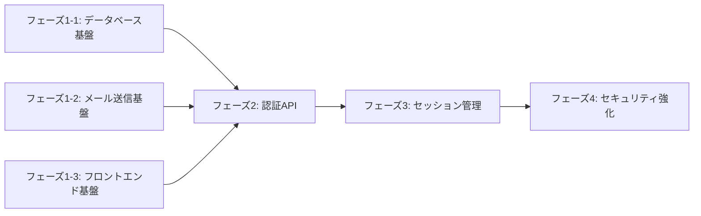

# 実装計画

## 概要
ユーザー認証システムの実装計画です。マジックリンク方式のメール認証機能を段階的に実装し、各フェーズで独立してテスト可能な機能を提供します。

## フェーズ構成

## フェーズ1-1: データベース基盤構築（並列実行可能）

### 要件1グループ: ユーザーデータモデル

- [ ] 1.1.1 データベーススキーマ設計
  - Userテーブル作成（id, email, name, avatarUrl, isActive, lastLoginAt）
  - AuthTokenテーブル作成（id, userId, token, type, expiresAt, isUsed）
  - UserSessionテーブル作成（id, userId, refreshToken, expiresAt）
  - LoginHistoryテーブル作成（id, userId, event, metadata）
  - _要件: 1_
  - _依存関係: なし_
  - _完了条件: スキーマ定義ファイルの作成完了_
  - **対応設計:** design.md「データベース設計」ERD

- [ ] 1.1.2 Prismaマイグレーション作成
  - Prismaスキーマファイル作成
  - マイグレーションファイル生成
  - 開発環境でのマイグレーション実行
  - _要件: 1_
  - _依存関係: 1.1.1_
  - _完了条件: マイグレーションが正常に実行される_
  - **対応設計:** design.md「データベース設計」Prismaスキーマ

- [ ] 1.1.3 リポジトリ層実装
  - UserRepositoryインターフェース定義
  - AuthTokenRepositoryインターフェース定義
  - Prisma実装クラス作成
  - _要件: 1_
  - _依存関係: 1.1.2_
  - _完了条件: 単体テストが通ること_
  - **対応設計:** design.md「コンポーネントとインターフェース」

- [ ] 1.1.4 要件1シナリオテスト作成・実行
  - ユーザー作成・取得テスト
  - トークン保存・検証テスト
  - セッション管理テスト
  - _要件: Story 1_
  - _依存関係: 1.1.3_
  - _完了条件: Story 1の受け入れ基準1.1-1.3を満たすテストが通ること_
  - **対応設計:** design.md「テスト戦略」単体テストセクション

## フェーズ1-2: メール送信基盤（並列実行可能）

### 要件2グループ: メール送信機能

- [ ] 1.2.1 メールサービスインターフェース定義
  - EmailServiceインターフェース作成
  - メールテンプレート型定義
  - エラーハンドリング設計
  - _要件: 2_
  - _依存関係: なし_
  - _完了条件: インターフェース定義完了_
  - **対応設計:** design.md「コンポーネントとインターフェース」

- [ ] 1.2.2 メールプロバイダ実装
  - SendGridアダプター実装
  - テンプレートエンジン統合
  - リトライロジック実装
  - _要件: 2_
  - _依存関係: 1.2.1_
  - _完了条件: メール送信テストが通ること_
  - **対応設計:** design.md「エラーハンドリング」リトライ戦略

- [ ] 1.2.3 マジックリンクテンプレート作成
  - HTMLメールテンプレート作成
  - プレーンテキスト版作成
  - 多言語対応（日本語・英語）
  - _要件: 2_
  - _依存関係: 1.2.2_
  - _完了条件: テンプレートレンダリングテストが通ること_
  - **対応設計:** design.md「フロントエンドコンポーネント」

- [ ] 1.2.4 要件2シナリオテスト作成・実行
  - メール送信成功テスト
  - エラーハンドリングテスト
  - リトライ機能テスト
  - _要件: Story 1_
  - _依存関係: 1.2.3_
  - _完了条件: Story 1の受け入れ基準1.1（メール送信）を満たすテストが通ること_
  - **対応設計:** design.md「テスト戦略」統合テストセクション

## フェーズ1-3: フロントエンド基盤（並列実行可能）

### 要件3グループ: 認証UI基盤

- [ ] 1.3.1 認証ページルーティング設定
  - /auth/loginページ作成
  - /auth/verifyページ作成
  - /auth/logoutページ作成
  - _要件: 3_
  - _依存関係: なし_
  - _完了条件: ルーティングテストが通ること_
  - **対応設計:** design.md「フロントエンドコンポーネント」pages

- [ ] 1.3.2 認証フォームコンポーネント実装
  - MagicLinkForm実装
  - バリデーション機能
  - エラー表示機能
  - _要件: 3_
  - _依存関係: 1.3.1_
  - _完了条件: コンポーネントテストが通ること_
  - **対応設計:** design.md「フロントエンドコンポーネント」components

- [ ] 1.3.3 認証状態管理Hook実装
  - useAuth Hook作成
  - Context Provider実装
  - ローカルストレージ管理
  - _要件: 3_
  - _依存関係: 1.3.2_
  - _完了条件: Hook単体テストが通ること_
  - **対応設計:** design.md「フロントエンドコンポーネント」hooks

- [ ] 1.3.4 要件3シナリオテスト作成・実行
  - フォーム入力・送信テスト
  - エラー表示テスト
  - 状態管理テスト
  - _要件: Story 1_
  - _依存関係: 1.3.3_
  - _完了条件: Story 1の受け入れ基準1.1-1.3を満たすE2Eテストが通ること_
  - **対応設計:** design.md「テスト戦略」E2Eテストセクション

## フェーズ1完了確認

### フェーズ1全体の完了条件
- [ ] 1.4.1 フェーズ1完了条件確認
  - フェーズ1-1: データベース基盤の全タスク完了
  - フェーズ1-2: メール送信基盤の全タスク完了
  - フェーズ1-3: フロントエンド基盤の全タスク完了
  - 全シナリオテストの成功
  - _依存関係: 1.1.4, 1.2.4, 1.3.4_
  - _完了条件: フェーズ1の全サブフェーズが完了していること_
  - **次フェーズ移行基準:** 
    - データベースマイグレーション完了
    - メール送信機能の動作確認済み
    - フロントエンドルーティング確立

## フェーズ2: 認証API実装（フェーズ1完了後）

### 要件4グループ: マジックリンク認証API

- [ ] 2.1.1 マジックリンク送信API実装
  - POST /api/auth/magic-linkエンドポイント
  - トークン生成ロジック
  - メール送信統合
  - レート制限実装
  - _要件: 4_
  - _依存関係: フェーズ1-1, 1-2, 1-3完了_
  - _完了条件: API統合テストが通ること_
  - **対応設計:** design.md「APIエンドポイント」認証API

- [ ] 2.1.2 トークン検証API実装
  - GET /api/auth/verifyエンドポイント
  - トークン有効性検証
  - セッション作成
  - JWT発行
  - _要件: 4_
  - _依存関係: 2.1.1_
  - _完了条件: 検証ロジックテストが通ること_
  - **対応設計:** design.md「シーケンス図」認証検証フロー

- [ ] 2.1.3 認証フロー統合実装
  - フロントエンド・API連携
  - エラーハンドリング
  - ローディング状態管理
  - _要件: 4_
  - _依存関係: 2.1.2_
  - _完了条件: 統合テストが通ること_
  - **対応設計:** design.md「データフロー図」

- [ ] 2.1.4 要件4シナリオテスト作成・実行
  - End-to-End認証フローテスト
  - エラーケーステスト
  - タイムアウトテスト
  - _要件: Story 2_
  - _依存関係: 2.1.3_
  - _完了条件: Story 2の受け入れ基準2.1-2.3を満たすE2Eテストが通ること_
  - **対応設計:** design.md「テスト戦略」E2Eテストセクション

## フェーズ2完了確認

### フェーズ2全体の完了条件
- [ ] 2.2.1 フェーズ2完了条件確認
  - マジックリンク送信APIの実装完了
  - トークン検証APIの実装完了
  - 認証フロー統合の完了
  - End-to-End認証フローテストの成功
  - _依存関係: 2.1.4_
  - _完了条件: フェーズ2の全タスクが完了していること_
  - **次フェーズ移行基準:** 
    - ユーザーがマジックリンクでログイン可能
    - トークン検証が正常に機能
    - セッションが作成される

## フェーズ3: セッション管理（フェーズ2完了後）

### 要件5グループ: セッション管理機能

- [ ] 3.1.1 リフレッシュトークンAPI実装
  - POST /api/auth/refreshエンドポイント
  - トークンローテーション
  - セッション延長ロジック
  - _要件: 5_
  - _依存関係: フェーズ2完了_
  - _完了条件: トークン更新テストが通ること_
  - **対応設計:** design.md「APIエンドポイント」認証API

- [ ] 3.1.2 ログアウトAPI実装
  - POST /api/auth/logoutエンドポイント
  - セッション無効化
  - トークン削除
  - _要件: 5_
  - _依存関係: 3.1.1_
  - _完了条件: ログアウトテストが通ること_
  - **対応設計:** design.md「APIエンドポイント」認証API

- [ ] 3.1.3 認証ガード実装
  - AuthGuardコンポーネント
  - 自動リフレッシュ機能
  - リダイレクト処理
  - _要件: 5_
  - _依存関係: 3.1.2_
  - _完了条件: 認証保護テストが通ること_
  - **対応設計:** design.md「フロントエンドコンポーネント」AuthGuard

- [ ] 3.1.4 要件5シナリオテスト作成・実行
  - セッション管理フローテスト
  - 自動更新テスト
  - タイムアウトテスト
  - _要件: Story 2_
  - _依存関係: 3.1.3_
  - _完了条件: Story 2の受け入れ基準2.1（セッション作成）を満たすE2Eテストが通ること_
  - **対応設計:** design.md「テスト戦略」E2Eテストセクション

## フェーズ3完了確認

### フェーズ3全体の完了条件
- [ ] 3.2.1 フェーズ3完了条件確認
  - リフレッシュトークンAPIの実装完了
  - ログアウトAPIの実装完了
  - 認証ガードの実装完了
  - セッション管理フローテストの成功
  - _依存関係: 3.1.4_
  - _完了条件: フェーズ3の全タスクが完了していること_
  - **次フェーズ移行基準:** 
    - セッションの自動更新が動作
    - ログアウトが正常に機能
    - 保護されたページへのアクセス制御が機能

## フェーズ4: セキュリティ強化（フェーズ3完了後）

### 要件6グループ: セキュリティ機能

- [ ] 4.1.1 レート制限実装
  - IP別制限ロジック
  - ユーザー別制限ロジック
  - Redis統合
  - _要件: 6_
  - _依存関係: フェーズ3完了_
  - _完了条件: レート制限テストが通ること_
  - **対応設計:** design.md「セキュリティ考慮事項」レート制限

- [ ] 4.1.2 セキュリティヘッダー設定
  - CSP設定
  - HSTS設定
  - その他セキュリティヘッダー
  - _要件: 6_
  - _依存関係: 4.1.1_
  - _完了条件: セキュリティ監査が通ること_
  - **対応設計:** design.md「セキュリティ考慮事項」セキュリティヘッダー

- [ ] 4.1.3 ログイン履歴機能実装
  - 履歴記録機能
  - 異常検知アルゴリズム
  - 通知機能
  - _要件: 6_
  - _依存関係: 4.1.2_
  - _完了条件: 履歴記録テストが通ること_
  - **対応設計:** design.md「モニタリングと分析」セキュリティメトリクス

- [ ] 4.1.4 要件6シナリオテスト作成・実行
  - セキュリティテストスイート
  - ペネトレーションテスト
  - パフォーマンステスト
  - _要件: Story 3_
  - _依存関係: 4.1.3_
  - _完了条件: Story 3の受け入れ基準3.1-3.2を満たすセキュリティテストが通ること_
  - **対応設計:** design.md「テスト戦略」セキュリティテストセクション

## 完了基準
- 全フェーズのタスクが完了していること
- 全てのシナリオテストが成功していること
- セキュリティ監査をパスしていること
- パフォーマンス目標を達成していること
- ドキュメントが最新化されていること